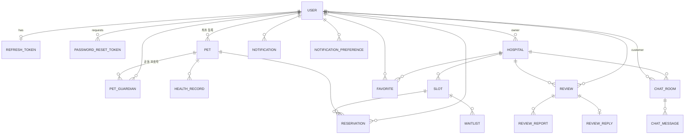
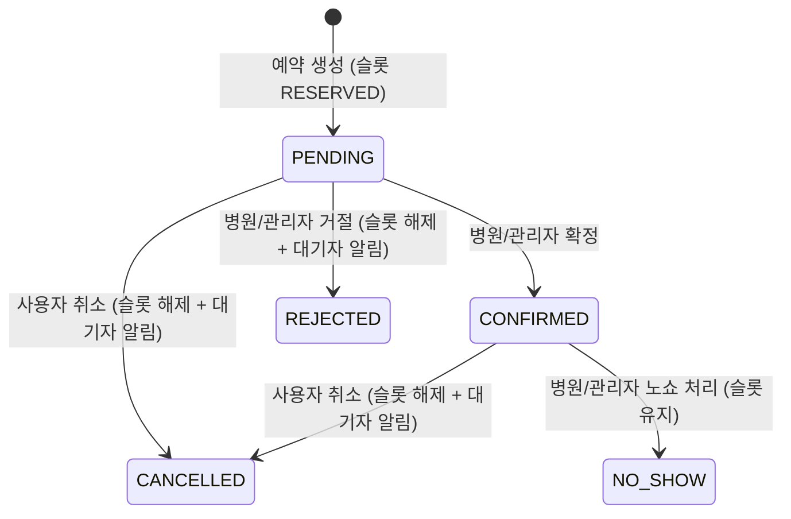

# PetCare System

반려동물 케어 통합 플랫폼 — 병원 검색·예약, 반려동물 프로필/건강 관리, 실시간 알림, 1:1 채팅, 리뷰, 병원 운영 대시보드, 관리자 패널까지 제공하는 풀스택 포트폴리오 프로젝트입니다. 백엔드(Spring Boot)와 프론트엔드(React)를 한 저장소에서 함께 개발했습니다.

> 혼자 설계부터 구현까지 진행한 개인 포트폴리오 프로젝트이며, 실서비스가 아닌 학습/데모 목적입니다.

## 목차

- [한눈에 보기](#한눈에-보기)
- [저장소 구조](#저장소-구조)
- [기술 스택](#기술-스택)
- [아키텍처](#아키텍처)
- [도메인 모델](#도메인-모델)
- [핵심 설계](#핵심-설계)
- [기능 상세](#기능-상세)
- [API 엔드포인트](#api-엔드포인트)
- [프론트엔드 화면 구성](#프론트엔드-화면-구성)
- [실행 방법](#실행-방법)
- [테스트](#테스트)
- [개발 과정에서 겪은 문제와 해결](#개발-과정에서-겪은-문제와-해결)
- [알려진 한계 / 설계상 트레이드오프](#알려진-한계--설계상-트레이드오프)
- [개발 이력](#개발-이력)
- [남은 작업](#남은-작업)

## 한눈에 보기

| 구분 | 내용 |
|---|---|
| 사용자 역할 | 보호자(`USER`) · 병원 소유자(`HOSPITAL_OWNER`) · 플랫폼 관리자(`ADMIN`) |
| 백엔드 | Spring Boot 3 / Java 21, 도메인 8개, REST 컨트롤러 20개, 엔드포인트 약 80개 |
| 프론트엔드 | React 19 + Vite, 소비자 앱 + 병원 운영 대시보드 + 별도 관리자 패널 |
| 실시간 | SSE 기반 알림 push (채팅 새 메시지 알림도 같은 채널 재사용) |
| 동시성 | 예약 슬롯 낙관적 락(`@Version`), 동시 예약 통합 테스트로 검증 |
| 문서 | Swagger UI, 설계 문서(`backend/CLAUDE.md`, `backend/ADMIN.md`, `frontend/API_MAP.md`, `frontend/PROGRESS.md`, `frontend/DESIGN_SPEC.md`) |

## 저장소 구조

모노레포로 구성되어 있으며, `main`/`backend`/`frontend` 세 브랜치가 저장소 전체(백엔드+프론트엔드)를 함께 스냅샷합니다.

```
petcare-project
├── backend                    # Spring Boot REST API
│   ├── CLAUDE.md              # 아키텍처/엔티티/컨벤션/겪은 버그 상세 문서
│   ├── ADMIN.md               # 관리자·병원 소유자 권한 모델과 관리 API 정리
│   ├── .env.example           # 환경변수 템플릿
│   └── src
│       ├── main/java/com/petcare
│       │   ├── domain
│       │   │   ├── user          # 회원/인증/Refresh Token/비밀번호 재설정
│       │   │   ├── pet           # 반려동물, 공동보호자, 건강기록, 급여량 계산기
│       │   │   ├── hospital      # 병원, 슬롯, 즐겨찾기, 리뷰/신고/답글
│       │   │   ├── reservation   # 예약, 대기자 명단
│       │   │   ├── notification  # 알림, 알림 설정, SSE, 리마인더 스케줄러
│       │   │   ├── chat          # 1:1 문의 채팅
│       │   │   ├── healthcheck   # 비대면 건강 자가문진
│       │   │   └── admin         # 통계/유저관리/예약관리/리뷰 모더레이션
│       │   └── global
│       │       ├── config        # QuerydslConfig, WebConfig(정적 리소스), AdminBootstrapRunner
│       │       ├── security      # JWT 필터/프로바이더, SecurityConfig(CORS 포함)
│       │       ├── exception     # GlobalExceptionHandler + 공통 예외
│       │       ├── file          # FileStorageService (반려동물/병원 사진 공용)
│       │       └── common        # ApiResponse, PageResponse, BaseEntity
│       └── test                  # AuthFlowTest, ReservationFlowTest, BusinessRuleTest (H2)
└── frontend                   # React (Vite) SPA
    ├── CLAUDE.md              # 개요/스택/API 계약/컨벤션
    ├── PROGRESS.md            # 날짜별 상세 변경 이력·설계 이유·알려진 한계
    ├── API_MAP.md             # 엔드포인트 ↔ 화면/컴포넌트 매핑
    ├── DESIGN_SPEC.md         # 디자인 시스템 단일 기준(색·폰트·형태·레이아웃)
    ├── petcare-ui-source/     # 화면별 HTML 디자인 시안 원본
    └── src
        ├── api          # axiosInstance + 도메인별 API 모듈 14개
        ├── components   # common(공통 UI 컴포넌트) / layout(Header, Layout)
        ├── hooks        # useAuth(인증+role), useNotifications(SSE 뱃지)
        ├── lib          # format.js (날짜/종/D-day/진료유형 포맷터)
        ├── pages        # auth / pet / hospital / reservation / mypage /
        │                # notification / chat / dashboard / admin
        └── router       # AppRouter, PrivateRoute, OwnerRoute, AdminRoute
```

패키지는 타입별(controller/service/…)이 아니라 **도메인별**로 묶었습니다. 각 도메인 안에 `Xxx`(엔티티), `XxxRepository`, `XxxService`, `XxxController`, `dto/`가 함께 위치합니다. 도메인 이름을 "예약"에 한정하지 않고 반려동물 케어 전반으로 확장 가능하게 설계했습니다.

## 기술 스택

**Backend**
- Java 21, Spring Boot 3.x, Gradle
- Spring Data JPA + Querydsl (동적 쿼리: 병원 검색/필터/정렬, 관리자 통계)
- Spring Security + JWT (Access Token + Refresh Token, stateless)
- MySQL 8 (로컬 개발은 Docker 컨테이너)
- Server-Sent Events (`SseEmitter`) — 실시간 알림
- Spring `@Scheduled` — 접종/예약 리마인더
- springdoc-openapi (Swagger UI, Bearer 인증 설정 포함)
- JUnit 5 통합 테스트 (H2 인메모리 DB)

**Frontend**
- React 19 (Vite 8, JavaScript)
- React Router v7 (SPA 라우팅, 역할 기반 보호 라우트)
- Axios (요청/응답 인터셉터로 토큰 자동 첨부 및 자동 재발급)
- Tailwind CSS v4 (`@theme` 디자인 토큰, `@utility` 공통 클래스)
- Motion(舊 Framer Motion) — 스크롤 진입/탭 전환/레이아웃 애니메이션
- Phosphor Icons
- Context API (전역 인증/알림 상태 — 규모상 Redux/Zustand 미사용)
- Oxlint

## 아키텍처

```mermaid
flowchart LR
    subgraph Client["브라우저 (React SPA)"]
        UI[소비자 앱 / 병원 대시보드 / 관리자 패널]
        AX[Axios 인터셉터<br/>토큰 첨부·자동 재발급]
        ES[EventSource<br/>?token= 쿼리 인증]
    end

    subgraph Server["Spring Boot"]
        F[JwtAuthenticationFilter]
        C[Controllers<br/>@PreAuthorize 역할 게이트]
        S[Services<br/>소유권/관리권한 재검증]
        R[Repositories<br/>JPA + Querydsl]
        SSE[SseEmitterRepository<br/>유저별 emitter 메모리 보관]
        SCH[ReminderScheduler<br/>매일 09:00]
        FS[FileStorageService<br/>uploads/]
    end

    DB[(MySQL)]

    UI --> AX --> F --> C --> S --> R --> DB
    ES --> F
    S -- notify() --> SSE -- push --> ES
    SCH --> S
    S --> FS
```

요청 흐름: `JwtAuthenticationFilter`가 토큰을 검증 → 컨트롤러의 `@PreAuthorize`가 역할(Role) 단위로 1차 차단 → 서비스 계층이 "이 리소스의 주인/관리자가 맞는가"를 2차 검증 → 모든 응답/예외는 `ApiResponse<T>` 포맷과 `GlobalExceptionHandler`를 거칩니다.

## 도메인 모델

모든 엔티티는 `BaseEntity`(createdAt/updatedAt, JPA Auditing)를 상속합니다.



| 엔티티 | 주요 필드 | 제약/비고 |
|---|---|---|
| `User` | email, password, role(`USER`/`HOSPITAL_OWNER`/`ADMIN`), suspended | 이메일 유니크 |
| `RefreshToken` | user, token, expiresAt | 유저당 1개(user_id 유니크) |
| `PasswordResetToken` | user, token, expiresAt, used | 30분 유효, 1회용 |
| `Pet` | user(최초 등록자), name, species(`DOG`/`CAT`), breed, birthDate, size(`SMALL`/`MEDIUM`/`LARGE`), sex(`MALE`/`FEMALE`), neutered, imageUrl | size/sex/neutered/image는 nullable |
| `PetGuardian` | pet, user | (pet, user) 유니크. 최초 등록자는 포함 안 됨 |
| `HealthRecord` | pet, type, recordedAt, content, weight, nextDueDate | type: `WEIGHT`/`VACCINATION`/`TREATMENT`/`WALK`/`MEAL`/`EXCRETION`/`HEALTH_CHECK` |
| `Hospital` | name, address, latitude, longitude, openingHours, specialty, is24Hours, hasParking, avgTreatmentPrice, imageUrl, owner | 평균 평점/리뷰 수는 컬럼이 아니라 응답 시 집계 |
| `Slot` | hospital, startTime, endTime, status(`AVAILABLE`/`RESERVED`), version | `@Version` 낙관적 락 |
| `Reservation` | slot, pet, user, status, type | status: `PENDING`/`CONFIRMED`/`REJECTED`/`CANCELLED`/`NO_SHOW`, type: `CHECKUP`/`VACCINATION`/`TREATMENT`/`SURGERY`/`GROOMING`/`ETC` |
| `Waitlist` | slot, pet, user | (slot, user) 유니크, RESERVED 슬롯에만 등록 |
| `Favorite` | user, hospital | (user, hospital) 유니크 |
| `Review` | hospital, user, rating(1~5), content, hidden | (user, hospital) 유니크 — 병원당 1개 |
| `ReviewReport` | review, reporter, reason | (review, reporter) 유니크 — 중복 신고 불가 |
| `ReviewReply` | review, content, author | 리뷰당 1개 |
| `ChatRoom` | customer, hospital | (customer, hospital) 유니크 |
| `ChatMessage` | chatRoom, sender, content | |
| `Notification` | user, type, content, isRead | 타입 11종 → 카테고리 5종으로 그룹핑 |
| `NotificationPreference` | user, category, enabled | (user, category) 유니크, 행 없으면 enabled=true |

**엔티티 컨벤션**
- `@NoArgsConstructor(access = PROTECTED)` + `@Builder` private 생성자만 사용, public setter 없음.
- 상태 변경은 `reserve()`, `cancel()`, `update()`, `changeEmail()`처럼 의미 있는 도메인 메서드로만.
- enum 컬럼은 전부 `@Column(columnDefinition = "varchar(N)")`로 VARCHAR 매핑 — MySQL 네이티브 ENUM은 `ddl-auto: update`가 새 enum 값을 반영하지 못해 "Data truncated" 에러를 냄(실제로 겪은 버그).

## 핵심 설계

### 1. 인증 & 세션
- JWT 기반 Stateless 인증. Access Token(1시간) + Refresh Token(14일, opaque random string) 동시 발급.
- Refresh Token은 유저당 1개만 유지(멀티 디바이스 미지원), `POST /api/auth/reissue` 호출마다 **회전(rotate)**하여 탈취 토큰 재사용 방지.
- 로그아웃은 DB의 Refresh Token만 삭제 — Access Token은 stateless 특성상 최대 1시간 뒤 자연 만료.
- `/api/auth/**`를 통째로 permitAll 하지 않고 `signup`/`login`/`reissue`/`password-reset/**`만 공개, `logout`은 인증 필요(전체를 열어둬서 logout이 인증 없이 호출되던 버그를 겪고 수정).
- 프론트 axios 인터셉터가 401을 감지하면 자동 재발급 후 원 요청을 재시도. 동시에 여러 요청이 401을 받아도 재발급 요청은 **한 번만** 나가도록 in-flight Promise를 공유.
- JWT subject가 이메일이라 **이메일 변경 시 기존 토큰이 즉시 무효화** → 프론트에서 자동 로그아웃 처리.
- 비밀번호 재설정: 존재하지 않는 이메일로 요청해도 항상 200(계정 존재 여부 노출 방지), 토큰은 30분 유효 + 1회용.

### 2. 역할(Role) 기반 접근 제어 — "컨트롤러 게이트 + 서비스 재검증"
- 신규 가입은 전부 `USER`. 공개된 관리자 가입 경로는 의도적으로 없음.
- 최초 관리자는 `AdminBootstrapRunner`(`ApplicationRunner`)가 서버 기동 시 `.env`의 `ADMIN_EMAIL`/`ADMIN_PASSWORD`로 자동 생성(이미 있으면 ADMIN으로 승격). 이후 관리자 추가는 기존 관리자가 역할 변경 API로 승격.
- 병원 소유자(`HOSPITAL_OWNER`)는 관리자가 병원에 유저를 연결해 지정하며, 대상이 `USER`면 자동 승격.
- `HOSPITAL_OWNER`도 쓰는 API는 `@PreAuthorize("hasRole('ADMIN') or hasRole('HOSPITAL_OWNER')")`로 문만 열어두고, 서비스 계층에서 `Hospital.isManagedBy(currentUser)`(ADMIN은 항상 true, 소유자는 본인 병원만 true)로 재검증. 어노테이션만으로는 "내 병원인지"를 걸러낼 수 없기 때문.
- 같은 관리 엔드포인트가 역할별로 스코핑됨 — 예: 예약 목록/리뷰 신고 목록은 ADMIN에겐 전체, HOSPITAL_OWNER에겐 본인 병원 것만.
- **자기 자신 보호**: 역할 변경·계정 정지는 대상이 본인이면 항상 403.
- 개인 리소스(반려동물, 예약 등)는 `엔티티.isOwnedBy(userId)`를 서비스 계층에서 체크, 위반 시 403.
- 공통 예외는 `NotFoundException`(404) / `ForbiddenException`(403) / `ConflictException`(409) 3개만 재사용(도메인별 예외 클래스 난립 방지). 예외적으로 `DuplicateEmailException`, `InvalidCredentialsException`만 전용 예외.
- 프론트는 `PrivateRoute`(로그인) / `OwnerRoute`(HOSPITAL_OWNER+ADMIN) / `AdminRoute`(ADMIN)로 라우트 가드.

### 3. 예약 동시성 제어 & 승인 플로우
- 예약 생성 시 슬롯을 즉시 `RESERVED`로 잠그고, `Slot`의 `@Version` 낙관적 락으로 동시 요청 중 한 건만 성공(나머지 409). 멀티스레드 통합 테스트로 검증.
- 예약은 곧바로 확정되지 않고 `PENDING`으로 생성 → 병원/관리자가 `CONFIRMED` 또는 `REJECTED` 처리.
- 상태 전이 규칙:



- 거절(`REJECTED`)과 취소(`CANCELLED`)는 주체와 의미가 달라 별도 상태로 분리. `REJECTED`/`CANCELLED`/`NO_SHOW`에서는 재취소 불가(409).
- 리뷰 작성 자격은 해당 병원 `CONFIRMED` 예약 이력 보유자만 — `PENDING`/`REJECTED`/`NO_SHOW`로는 불가.
- 예약 시 **진료 유형**(정기검진/예방접종/진료/수술/미용/기타)을 필수로 선택.
- `ReservationResponse`에 반려동물 스냅샷(이름/종/품종/생년월일/크기/성별/중성화/사진)과 병원명·예약 시간을 함께 실어 보내 프론트의 클라이언트 조인을 전부 제거(대기자 명단 응답도 동일).
- 리뷰 응답의 `mine`으로 요청자 본인 리뷰를 판별 — 작성자 id 자체는 노출하지 않음.

### 4. 실시간 기능 (SSE)
- WebSocket 대신 SSE 채택 — 알림은 서버→클라이언트 단방향이라 충분하고 구현이 훨씬 단순.
- 브라우저 `EventSource`는 커스텀 헤더를 못 보내므로, `GET /api/notifications/subscribe` 경로에 한해서만 `?token=` 쿼리 파라미터 인증을 허용(`JwtAuthenticationFilter`에서 경로 체크). 다른 엔드포인트는 여전히 Authorization 헤더만 허용.
- `NotificationService.notify()` 흐름: 알림 설정 조회 → 꺼진 카테고리면 저장도 push도 안 함 → DB 저장 → 연결된 emitter가 있으면 즉시 push, 없으면 다음 폴링에서 확인.
- **1:1 채팅은 별도 채널을 만들지 않고 알림 SSE를 재사용**: 메시지 전송 시 상대에게 `CHAT_MESSAGE_RECEIVED` 알림만 push하고, 프론트가 이를 받으면 메시지 목록을 다시 조회(notify-then-refetch).

### 5. 알림 & 리마인더
- 알림 타입 11종: 예약 요청/확정/거절/취소/노쇼, 예약 리마인더, 접종 예정 임박, 찜한 병원 새 슬롯, 채팅 메시지, 대기 슬롯 오픈.
- `NotificationType.category()`로 5개 카테고리(예약/접종/찜/채팅/대기자)에 그룹핑 → 카테고리 단위 on/off.
- `ReminderScheduler`(`@Scheduled(cron = "0 0 9 * * *")`, `@Transactional`)가 매일 09시에 접종 예정일이 3일 이내인 기록과 내일까지의 확정 예약에 알림을 생성. 발송 여부를 플래그(`Reservation.reminderSent`, `HealthRecord.remindedDueDate`)로 남겨서 여러 번 실행해도 한 번만 가고, 범위로 매칭하므로 09시에 서버가 꺼져 있었어도 다음 실행 때 누락분을 보냄. 관리자는 `POST /api/admin/reminders/run`으로 즉시 실행 가능(데모용).
- SSE 연결은 25초마다 heartbeat(`:ping` 주석)를 보내 프록시/로드밸런서의 유휴 연결 끊김을 막고, 끊긴 연결을 정리.
- 슬롯 생성 시 그 병원을 찜한 유저 전원에게 `FAVORITE_HOSPITAL_NEW_SLOT` 자동 발송.
- 예약 요청 시 요청자와 병원 소유자 모두에게 `RESERVATION_REQUESTED` 발송.
- 예약 취소/거절로 슬롯이 다시 열리면 대기열 1순위(`createdAt` 기준) **한 명에게만** `WAITLIST_SLOT_AVAILABLE`을 보내고 대기 항목 삭제(선착순 스탬피드 방지).

### 6. 다중 보호자(가족 공유) 권한 모델
- 최초 등록자(`Pet.user`)와 공동보호자(`PetGuardian`)는 프로필/건강기록/예약/사진 등 **일상 관리 권한이 완전히 동등**.
- 단, "누가 접근할 수 있는가"를 결정하는 **보호자 초대·퇴출과 반려동물 삭제는 최초 등록자만** 가능.
- `Pet.isOwnedBy()`는 소유자 판단으로 그대로 두고, 접근 권한이 필요한 4곳(`PetService`, `HealthRecordService`, `ReservationService.create()`, `WaitlistService.join()`)에만 `|| petGuardianRepository.existsByPetIdAndUserId(...)`를 추가 — 호출부가 4곳뿐이라 새 추상화는 만들지 않음.
- `GET /api/pets`는 "소유 OR 공유" 펫을 OR-EXISTS 서브쿼리 하나로 페이지네이션하고, 응답의 `role`(OWNER/GUARDIAN)로 요청자 기준 역할 표시.
- **삭제 정책**: 건강기록/대기열/보호자 관계는 함께 정리(cascade)하지만, 예약은 슬롯 상태·통계·리뷰 자격과 얽혀 있어 **예약 이력이 있는 반려동물은 삭제 자체를 409로 차단**.

### 7. 데이터 조회 (Querydsl) & 페이지네이션
- 병원 검색(`HospitalRepositoryImpl`): Hospital–Review left join + group by로 평균 평점/리뷰 수 집계, 키워드·최소 평점·24시간·주차 필터, 이름순/평점순/리뷰수순 정렬을 **쿼리 하나로** 처리. 숨김 처리된 리뷰는 집계에서 제외.
- 거리 필터: `lat`/`lng`/`radiusKm`을 모두 주면 Haversine 공식으로 서비스 계층에서 계산(병원 수가 적어 DB 공간 함수 대신 순수 자바), 좌표 없는 병원은 제외, 응답에 `distanceKm` 포함.
- Querydsl 커스텀 레포지토리 패턴: `XxxRepositoryCustom` + `XxxRepositoryImpl` + `XxxRepository extends JpaRepository, XxxRepositoryCustom`.
- 대부분의 목록 API는 `Pageable`(`page`, `size`, `sort`, 기본 size 20) → `PageResponse{content, page, size, totalElements, totalPages}`.
- 의도적으로 페이지네이션하지 않은 목록: 병원 검색(거리 필터를 메모리에서 계산), 관리자 병원별 통계(리포트성), 마이페이지 D-day 목록(소량).

### 8. 파일 업로드
- 반려동물/병원 사진을 로컬 디스크(`uploads/pets/`, `uploads/hospitals/`)에 저장, `FileStorageService` 하나로 공용화.
- 클라이언트 파일명을 쓰지 않고 UUID로 재생성(경로 조작 방지), jpg/png/webp만 허용, 5MB 제한.
- `/uploads/**`는 공개 서빙(permitAll).

## 기능 상세

### 인증 / 계정
- 회원가입, 로그인/로그아웃, Access/Refresh Token 자동 재발급
- 비밀번호 찾기(이메일 요청 → 토큰 기반 재설정) — 실제 메일 발송 대신 서버 로그로 대체된 데모 구현
- 내 정보 조회, 이메일 변경(변경 시 자동 로그아웃), 비밀번호 변경
- 정지된 계정은 즉시 차단 — 로그인·토큰 재발급 403, 기존 Access Token도 다음 요청부터 401
- 로그인 직후 역할 확인 → ADMIN은 관리자 패널(`/admin`)로, 그 외는 홈으로 자동 이동

### 반려동물
- 반려동물 CRUD — 이름, 종(강아지/고양이), 품종, 생년월일, 크기, **성별, 중성화 여부(완료/안함/모름)**, 사진
- 반려동물 상세는 탭 구성: 개요(읽기전용 정보 카드 + 현재 체중, 연필 아이콘으로 수정 모드 진입) · 건강기록 · 급여량 · 보호자
- 사진 업로드/삭제
- 다중 보호자(가족 공유): 이메일로 공동보호자 즉시 초대, 목록 조회, 소유자의 퇴출, 보호자 본인의 자발적 나가기
- 건강 기록: 체중/예방접종/진료/산책/식사/배변/자가문진 7종 CRUD, 다음 접종·진료 예정일 입력
- 건강 기록 통계: 체중 변화 그래프(`weightHistory`), 최신 체중, 타입별 기록 수
- 사료 급여량 계산기: RER = 70 × 체중^0.75, DER = RER × 활동계수(강아지 LOW/NORMAL/HIGH = 1.4/1.6/1.8, 고양이 1.0/1.2/1.4), 사료 칼로리 밀도 기본 350kcal/100g(override 가능)
- 비대면 건강 자가문진: 식욕/배변/구토/기력/피부/호흡/음수/체중 8문항 → 점수 합산으로 낮음(0~3)/주의(4~9)/높음(10+) 판정, 3단계 위저드 UI(반려동물 선택 → 문항 1개씩 + 진행바 → 결과), 결과를 건강기록으로 저장 가능. 진단이 아닌 참고용이라는 disclaimer와, 품종/연령별 통계가 없다는 사실을 그대로 안내

### 병원
- 병원 목록/검색 — 키워드, 최소 평점, 내 위치 기준 반경 검색, 24시간 운영, 주차 가능 필터 + 이름/평점/리뷰수 정렬 (데스크톱은 좌측 필터 사이드바)
- 병원 상세 탭: 정보(운영시간/진료과목/평균 진료비/사진/평점) · 예약(슬롯 선택 + 반려동물 + 진료 유형) · 리뷰
- 즐겨찾기(찜) — 찜한 병원에 새 슬롯이 열리면 자동 알림, 찜 목록 페이지
- 리뷰 작성/수정/삭제(방문 확정 이력자만), 리뷰 신고, 병원측 답글 표시

### 예약
- 예약 생성 → `PENDING` → 병원/관리자 확정 또는 거절
- 내 예약 목록 — 전체/대기중/확정/지난 예약(거절·취소·노쇼) 칩 필터와 개수, 반려동물 이름·진료유형 배지 표시
- 예약 취소(PENDING/CONFIRMED만)
- 마감된 슬롯에 대기자 명단 등록/취소, 슬롯이 열리면 1순위에게 알림

### 알림
- 알림 목록, 개별/전체 읽음 처리, 헤더의 안읽은 개수 뱃지(SSE로 실시간 갱신)
- 카테고리(예약/접종/찜한병원/채팅/대기자명단)별 수신 on/off
- 예방접종 3일 전부터, 예약 전날·당일 자동 리마인더 (중복 발송 없음, 서버 중단 시 누락분 보충)
- 마이페이지 예정 접종 D-day 목록

### 채팅
- 고객-병원 1:1 문의방 get-or-create, 방 목록(USER는 본인 방, HOSPITAL_OWNER는 본인 병원 방, ADMIN은 전체 접근 가능), 메시지 송수신
- 새 메시지 실시간 알림 → 열려 있는 채팅방이면 자동 재조회

### 병원 운영 대시보드 (`/dashboard`, HOSPITAL_OWNER·ADMIN)
- 예약 관리: 대기 예약 확정/거절, 확정 예약 노쇼 처리
- 병원 정보 수정, 병원 사진 업로드
- 예약 슬롯 등록(과거 시간·같은 병원 겹치는 시간대 거부), 반복 일괄 등록(기간·요일·시간대·간격 지정, 겹치는 칸은 건너뜀), 예약 이력 없는 슬롯 삭제
- 리뷰 답글 작성/수정/삭제
- 백엔드는 리뷰 신고 조회·숨김 API도 HOSPITAL_OWNER에게 본인 병원 범위로 열어두었음(현재 화면은 관리자 패널에만 있음)

### 관리자 패널 (`/admin/*`, ADMIN 전용)
소비자 앱과 완전히 분리된 레이아웃(데스크톱 좌측 사이드바 / 모바일 상단 탭, stone-900 어두운 톤, 밀도 높은 표 중심 UI)으로 구성했습니다. 색 토큰만 공유하고 형태(버튼·입력·표)는 `admin-*` 전용 유틸리티로 의도적으로 다르게 가져갔습니다.

| 화면 | 내용 |
|---|---|
| 대시보드 `/admin` | 요약 KPI 7개, 병원별 예약 순위 바, "처리가 필요해요" 퀵링크(대기 예약·미처리 신고 건수), 리마인더 수동 실행 |
| 통계 `/admin/stats` | KPI, 예약 상태 분포 스택바, 검색·정렬 가능한 병원별 통계 표 |
| 사용자 `/admin/users` | 검색·역할/정지 필터, 인라인 역할 변경·정지/해제 |
| 사용자 상세 `/admin/users/:userId` | 개인 통계 — 예약 수, 노쇼 수(율), 작성한 리뷰 답글 수, 등록 펫 수, 공동보호자 수 |
| 병원 `/admin/hospitals` | 병원 목록/검색, 병원 등록, 소유자 지정 |
| 예약 `/admin/reservations` | 전체 예약 상태별 조회, 확정/거절/노쇼 처리 |
| 리뷰 신고 `/admin/reviews` | 신고 카드(리뷰 원문 + 별점 + 신고 사유 + 병원명 + 일시), "노출중인 신고만" 필터, 숨김/해제 |

### 프론트엔드 UX / 디자인 시스템
- `petcare-ui-source/`의 HTML 시안을 `DESIGN_SPEC.md` 기준으로 전 화면 이식 — 디자인 토큰(`@theme` brand 램프)부터 교체해 기존 클래스 호출부를 고치지 않고 새 팔레트 적용
- 색: 단일 teal 액센트(`#0F766E`), stone 중성 배경, 상태별 뱃지 색(대기 amber / 확정 green / 거절·노쇼 red / 취소 회색)
- 폰트: Jua(로고·제목·강조 숫자) + Noto Sans KR(본문)
- 형태 규칙: 버튼 pill / 카드 rounded-2xl / 입력창 rounded-lg
- 반응형(모바일 퍼스트): 모바일 56px 헤더 + 76px 하단 탭바(활성 탭 pill 슬라이드), 데스크톱 72px 상단 네비 + 1120px 중앙 본문
- 역할별 탭 구성: 보호자는 홈·반려동물·병원·예약·마이페이지, 병원/관리자는 홈·대시보드·채팅·알림·마이페이지
- 공통 컴포넌트: Button, TextField, SelectField, ChoiceGroup, Toggle(role=switch), Tabs(motion 밑줄), Alert, EmptyState, StatusBadge, MenuList, PageHeader, InfoRow, Stars, Reveal
- 공통 스타일은 Tailwind v4 `@utility`(`card`, `btn-*`, `input`, `chip*`, `segmented`, `badge-*`, `icon-badge*`, 관리자용 `admin-*`)
- 스크롤 진입 애니메이션, 버튼 프레스/호버 피드백, 커스텀 404, 스킵 링크 등 접근성/완성도 디테일

## API 엔드포인트

모든 응답은 `{ success, data, message }` 래퍼를 사용합니다. 에러 코드: 400 유효성 실패, 401 인증 실패/토큰 만료, 403 권한 없음, 404 없음, 409 충돌.
표기: 🔓 인증 불필요 · 👑 ADMIN 전용 · 🏥 ADMIN 또는 해당 병원 HOSPITAL_OWNER · 표기 없음 = 로그인 필요

<details>
<summary><b>인증 / 사용자</b></summary>

| Method | Path | 설명 |
|---|---|---|
| POST | `/api/auth/signup` 🔓 | 회원가입 (USER로 생성) |
| POST | `/api/auth/login` 🔓 | 로그인 → accessToken, refreshToken, expiresIn |
| POST | `/api/auth/reissue` 🔓 | 토큰 재발급 (refreshToken 회전) |
| POST | `/api/auth/logout` | refreshToken 폐기 |
| POST | `/api/auth/password-reset/request` 🔓 | 재설정 토큰 발급 (항상 200) |
| POST | `/api/auth/password-reset/confirm` 🔓 | 토큰 + 새 비밀번호로 재설정 |
| GET | `/api/users/me` | 내 정보 (role, userId 포함) |
| PATCH | `/api/users/me` | 이메일 변경 (기존 토큰 무효화) |
| PATCH | `/api/users/me/password` | 비밀번호 변경 |
| GET | `/api/users/me/upcoming-vaccinations` | 예정 접종 D-day 목록 |

</details>

<details>
<summary><b>반려동물 / 공동보호자 / 건강기록 / 자가문진</b></summary>

| Method | Path | 설명 |
|---|---|---|
| POST | `/api/pets` | 반려동물 등록 |
| GET | `/api/pets` | 내 반려동물 목록 (소유+공유, role 표시) |
| GET | `/api/pets/{petId}` | 상세 |
| PATCH | `/api/pets/{petId}` | 수정 (전체 필드 재입력) |
| DELETE | `/api/pets/{petId}` | 삭제 (최초 등록자만, 예약 이력 있으면 409) |
| POST / DELETE | `/api/pets/{petId}/image` | 사진 업로드 / 삭제 |
| POST | `/api/pets/{petId}/feeding-calculator` | 급여량 계산 |
| POST | `/api/pets/{petId}/guardians` | 공동보호자 초대 (이메일, 소유자만) |
| GET | `/api/pets/{petId}/guardians` | 공동보호자 목록 |
| DELETE | `/api/pets/{petId}/guardians/{userId}` | 보호자 퇴출 (소유자만) |
| DELETE | `/api/pets/{petId}/guardians/me` | 보호자 본인 나가기 |
| POST | `/api/pets/{petId}/health-records` | 건강기록 등록 |
| GET | `/api/pets/{petId}/health-records` | 건강기록 목록 |
| GET | `/api/pets/{petId}/health-records/summary` | 체중 그래프/최신 체중/타입별 개수 |
| PATCH / DELETE | `/api/pets/{petId}/health-records/{recordId}` | 수정 / 삭제 |
| GET | `/api/health-check/questions` | 자가문진 문항 |
| POST | `/api/health-check/submit` | 제출 → 위험도 판정 (`saveRecord`로 기록 저장) |

</details>

<details>
<summary><b>병원 / 슬롯 / 즐겨찾기 / 리뷰</b></summary>

| Method | Path | 설명 |
|---|---|---|
| POST | `/api/hospitals` 👑 | 병원 등록 |
| GET | `/api/hospitals` | 검색 `keyword, minRating, sort, lat, lng, radiusKm, is24Hours, hasParking` |
| GET | `/api/hospitals/{hospitalId}` | 상세 (평균 평점/리뷰 수 포함) |
| PATCH | `/api/hospitals/{hospitalId}` 🏥 | 정보 수정 |
| POST / DELETE | `/api/hospitals/{hospitalId}/image` 🏥 | 사진 업로드 / 삭제 |
| POST | `/api/hospitals/{hospitalId}/slots` 🏥 | 슬롯 등록 (찜한 유저에게 알림) |
| POST | `/api/hospitals/{hospitalId}/slots/bulk` 🏥 | 슬롯 일괄 등록 (최대 31일·500개, `{created, skipped}` 반환) |
| DELETE | `/api/hospitals/{hospitalId}/slots/{slotId}` 🏥 | 슬롯 삭제 (예약 가능 + 예약 이력 없음만) |
| GET | `/api/hospitals/{hospitalId}/slots` | 슬롯 목록 (지난 슬롯 제외, 시간순) |
| POST / DELETE | `/api/hospitals/{hospitalId}/favorites` | 찜 / 찜 해제 |
| GET | `/api/favorites` | 내 찜 목록 |
| POST | `/api/hospitals/{hospitalId}/reviews` | 리뷰 작성 (CONFIRMED 이력자만) |
| GET | `/api/hospitals/{hospitalId}/reviews` | 리뷰 목록 (숨김 제외, 답글 포함) |
| PATCH / DELETE | `/api/hospitals/{hospitalId}/reviews/{reviewId}` | 리뷰 수정 / 삭제 |
| POST | `/api/hospitals/{hospitalId}/reviews/{reviewId}/report` | 리뷰 신고 (중복 409) |
| POST / PATCH / DELETE | `/api/hospitals/{hospitalId}/reviews/{reviewId}/reply` 🏥 | 답글 작성 / 수정 / 삭제 |

</details>

<details>
<summary><b>예약 / 대기자 명단</b></summary>

| Method | Path | 설명 |
|---|---|---|
| POST | `/api/reservations` | 예약 생성 (`slotId, petId, type`) → PENDING |
| GET | `/api/reservations` | 내 예약 목록 |
| GET | `/api/reservations/{reservationId}` | 예약 상세 |
| PATCH | `/api/reservations/{reservationId}/cancel` | 예약 취소 |
| POST | `/api/waitlists` | 대기 등록 (RESERVED 슬롯만) |
| GET | `/api/waitlists` | 내 대기 목록 |
| DELETE | `/api/waitlists/{waitlistId}` | 대기 취소 |

</details>

<details>
<summary><b>알림 / 채팅</b></summary>

| Method | Path | 설명 |
|---|---|---|
| GET | `/api/notifications` | 알림 목록 |
| GET | `/api/notifications/subscribe` | SSE 구독 (`?token=` 허용) |
| GET | `/api/notifications/unread-count` | 안읽은 개수 |
| PATCH | `/api/notifications/{notificationId}/read` | 읽음 처리 |
| PATCH | `/api/notifications/read-all` | 전체 읽음 처리 (처리 건수 반환) |
| GET | `/api/notifications/preferences` | 카테고리별 설정 (항상 5개) |
| PATCH | `/api/notifications/preferences` | `{category, enabled}` upsert |
| POST | `/api/chat-rooms` | 채팅방 get-or-create |
| GET | `/api/chat-rooms` | 채팅방 목록 |
| GET | `/api/chat-rooms/{roomId}/messages` | 메시지 목록 |
| POST | `/api/chat-rooms/{roomId}/messages` | 메시지 전송 (상대에게 알림) |

</details>

<details>
<summary><b>관리자</b></summary>

| Method | Path | 권한 | 설명 |
|---|---|---|---|
| GET | `/api/admin/users` | 👑 | 유저 목록 |
| GET | `/api/admin/users/{userId}/stats` | 👑 | 유저 상세 통계 |
| PATCH | `/api/admin/users/{userId}/role` | 👑 | 역할 변경 (본인 불가) |
| PATCH | `/api/admin/users/{userId}/suspend` | 👑 | 계정 정지 (본인 불가) |
| PATCH | `/api/admin/users/{userId}/activate` | 👑 | 정지 해제 |
| PATCH | `/api/admin/hospitals/{hospitalId}/owner` | 👑 | 병원 소유자 지정 (USER면 자동 승격) |
| GET | `/api/admin/reservations?status=` | 🏥 | 예약 목록 (소유자는 본인 병원만) |
| PATCH | `/api/admin/reservations/{id}/confirm` | 🏥 | 확정 (PENDING만) |
| PATCH | `/api/admin/reservations/{id}/reject` | 🏥 | 거절 (PENDING만, 슬롯 해제 + 대기자 알림) |
| PATCH | `/api/admin/reservations/{id}/no-show` | 🏥 | 노쇼 (CONFIRMED만) |
| GET | `/api/admin/reviews/reports` | 🏥 | 리뷰 신고 목록 (소유자는 본인 병원만) |
| PATCH | `/api/admin/reviews/{reviewId}/hide` | 🏥 | 리뷰 숨김 |
| PATCH | `/api/admin/reviews/{reviewId}/unhide` | 🏥 | 숨김 해제 |
| GET | `/api/admin/stats/summary` | 👑 | 전체 요약 (유저/펫/병원/예약, 확정/취소/노쇼) |
| GET | `/api/admin/stats/hospitals` | 👑 | 병원별 확정 예약/리뷰 수/평균 평점 |
| POST | `/api/admin/reminders/run` | 👑 | 리마인더 즉시 실행 |

</details>

전체 명세(요청/응답 스키마)는 백엔드 실행 후 Swagger UI에서 확인할 수 있습니다: `http://localhost:8080/swagger-ui/index.html`

## 프론트엔드 화면 구성

| 경로 | 화면 | 접근 |
|---|---|---|
| `/login`, `/signup` | 로그인 / 회원가입 | 공개 |
| `/forgot-password`, `/reset-password` | 비밀번호 찾기 / 재설정 (`?token=` 지원) | 공개 |
| `/` | 홈 — 인사말, 반려동물 아바타, 예정 접종, 다가오는 예약, 바로가기 | 로그인 |
| `/pets`, `/pets/new`, `/pets/:petId` | 반려동물 목록 / 등록 / 상세(개요·건강기록·급여량·보호자 탭) | 로그인 |
| `/health-check` | 건강 자가문진 위저드 | 로그인 |
| `/hospitals`, `/hospitals/:hospitalId` | 병원 검색 / 상세(정보·예약·리뷰 탭) | 로그인 |
| `/favorites` | 찜한 병원 | 로그인 |
| `/reservations`, `/waitlist` | 내 예약(상태 필터) / 대기 목록 | 로그인 |
| `/notifications` | 알림 목록 | 로그인 |
| `/chats`, `/chats/:roomId` | 채팅방 목록 / 채팅방 | 로그인 |
| `/mypage`, `/mypage/notifications`, `/mypage/account` | 마이페이지 / 알림 설정 / 계정 설정 | 로그인 |
| `/dashboard` | 병원 운영 대시보드(예약관리·병원정보·슬롯·리뷰답글 탭) | HOSPITAL_OWNER, ADMIN |
| `/admin/*` | 관리자 패널 (별도 레이아웃) | ADMIN |
| `*` | 커스텀 404 | 공개 |

## 실행 방법

### 사전 준비
- Java 21, Node.js 20+, Docker(또는 로컬 MySQL 8)

### Backend

```bash
cd backend

# 1) MySQL 준비 (예시 — 실제 계정/비밀번호는 직접 지정)
docker run --name petcare-mysql \
  -e MYSQL_ROOT_PASSWORD=<root_password> \
  -e MYSQL_DATABASE=petcare \
  -e MYSQL_USER=<db_user> \
  -e MYSQL_PASSWORD=<db_password> \
  -p 3306:3306 -d mysql:8.0
# 이후 재시작은 docker start petcare-mysql

# 2) 환경변수 파일 생성
cp .env.example .env
# DB_USERNAME / DB_PASSWORD      : 위에서 지정한 DB 계정
# JWT_SECRET                     : 충분히 긴 랜덤 값 (예: openssl rand -base64 64)
# ADMIN_EMAIL / ADMIN_PASSWORD   : 최초 관리자 계정 (비워두면 부트스트랩 생략)

# 3) 실행 (http://localhost:8080)
./gradlew bootRun
```

- 스키마는 `ddl-auto: update`로 자동 생성됩니다.
- 서버 기동 시 `ADMIN_EMAIL`/`ADMIN_PASSWORD`로 최초 관리자가 자동 생성됩니다.
- 병원 소유자 계정이 필요하면 관리자 패널 `/admin/hospitals`에서 병원 등록 후 기존 유저를 소유자로 지정하면 됩니다.
- 비밀번호 재설정 링크는 서버 로그에 `[비밀번호 재설정] ...` 형태로 출력됩니다.

### Frontend

```bash
cd frontend
npm install
npm run dev      # http://localhost:5173
npm run build    # 프로덕션 빌드
npm run lint     # oxlint
```

백엔드 CORS는 `localhost:5173`, `localhost:3000`과 사설망 IP(`192.168.*.*`, `10.*.*.*`, `172.*.*.*`)의 `:5173`을 허용합니다 — 같은 Wi-Fi의 휴대폰에서 개발 서버 LAN IP로 접속해 모바일 화면을 확인할 수 있습니다. 다른 오리진은 `SecurityConfig.corsConfigurationSource()`에 추가하세요.

## 테스트

```bash
cd backend
./gradlew test
```

| 테스트 | 검증 내용 |
|---|---|
| `AuthFlowTest` | 회원가입 → 로그인, 이메일 중복 가입 거부, 잘못된 비밀번호 로그인 실패 |
| `BusinessRuleTest` | 과거/겹치는 슬롯 생성 거부, 지난 슬롯 예약·대기신청·취소 거부와 노쇼 시점 제한, 다른 병원 소유자의 예약 확정 403과 새 예약 알림, 공동보호자의 반려동물 삭제 403, 예약 취소 시 대기 1순위에게만 알림, 계정 정지 즉시 반영(기존 토큰 401·재발급 403), 슬롯 일괄 등록(겹치는 칸 건너뛰기·31일/500개 제한)과 삭제 조건, 슬롯 조회의 지난 슬롯 제외·시간순, 예약 응답의 병원명·시간과 리뷰 `mine`, 리마인더 중복 방지(여러 번 실행해도 1회, 접종 예정일 변경 시 재발송) |
| `ReservationFlowTest` | 예약 생성 시 PENDING → 관리자 확정 흐름, **멀티스레드로 같은 슬롯에 동시 예약 시 정확히 1건만 성공**(낙관적 락) |

- 개발용 MySQL을 건드리지 않도록 H2 인메모리 DB(`application-test.yml`, `@ActiveProfiles("test")`)로 실행합니다.
- 자동화 테스트 외에도 기능 추가 시마다 `bootRun`으로 서버를 띄우고 curl로 정상 케이스와 에러 케이스(권한 없음/중복/유효성 실패 등)를 직접 호출해 검증했습니다.

## 개발 과정에서 겪은 문제와 해결

| 문제 | 원인 | 해결 |
|---|---|---|
| enum에 값 추가 후 "Data truncated" 런타임 에러 | MySQL 네이티브 ENUM 컬럼을 `ddl-auto: update`가 갱신하지 못함 | 모든 enum 컬럼을 `columnDefinition = "varchar(N)"`로 매핑 |
| 런타임에 "테이블 없음" 에러 | `read`, `order` 같은 MySQL 예약어를 컬럼명으로 사용해 DDL이 조용히 실패 | `@Column(name = ...)`으로 명시적 회피 |
| 기존 행의 새 NOT NULL 컬럼이 빈 문자열("")로 채워짐 | non-strict 모드 MySQL이 DEFAULT 없는 `ADD COLUMN ... NOT NULL`을 에러 없이 통과시킴 (`Pet.species` 추가 때) | 컬럼 추가 후 `UPDATE ... WHERE col = '' OR col IS NULL`로 수동 백필 |
| 로그아웃이 인증 없이 호출됨 | `/api/auth/**` 전체를 permitAll | 공개 경로를 signup/login/reissue/password-reset으로 한정 |
| 스케줄러에서 `LazyInitializationException` | 트랜잭션 밖에서 지연 로딩 엔티티 접근 | `ReminderScheduler`에 `@Transactional` |
| 예약 이력 있는 반려동물 삭제 시 500 | Reservation FK 제약 위반 | 삭제 전 예약 이력 체크 후 409로 명시적 거부 |
| H2 테스트에서 DDL 실패 | `user`가 H2 예약어 | JDBC URL에 `NON_KEYWORDS=USER` |
| 두 번째 테스트의 `@BeforeEach`에서 유니크 충돌 | `@SpringBootTest` 컨텍스트(DB)를 테스트 간 공유 | 테스트마다 `System.nanoTime()` 등으로 고유 이메일 사용 |
| 동시성 테스트에서 워커 스레드가 데이터를 못 찾음 | 테스트 클래스 `@Transactional` 때문에 메인 스레드 데이터가 미커밋 상태 | 동시성 테스트 클래스에는 `@Transactional`을 걸지 않음 |
| 예약 생성이 400으로 실패 | 백엔드에서 `type`이 필수(`@NotNull`)가 됐는데 프론트 미반영 | 예약 폼에 진료 유형 필수 선택 추가, 미선택 시 버튼 비활성화 |
| Tailwind 클래스가 조용히 무시됨 | Tailwind v4 동적 spacing은 정수만 생성(`h-5.5` 등 미생성), `@layer components` 클래스는 `@apply`로 조합 불가 | 정수 값으로 교체, 공통 클래스를 `@utility`로 정의 |

## 알려진 한계 / 설계상 트레이드오프

포트폴리오 특성상 의도적으로 범위를 좁히거나, 실사용 전 보완이 필요하다고 판단한 지점을 투명하게 남겨둡니다.

- **비밀번호 재설정 이메일 미발송**: 재설정 링크를 서버 로그로만 남깁니다. 실사용 전 메일 발송 연동이 필요합니다.
- **SSE는 단일 서버 인스턴스 기준**: 활성 연결을 메모리(ConcurrentHashMap)에 보관하므로 스케일아웃 시 다른 인스턴스에 붙은 클라이언트에게는 전달되지 않습니다. 필요 시 Redis Pub/Sub 등으로 브로드캐스트를 추가해야 합니다.
- **로그아웃 시 Access Token 즉시 무효화 불가**: 로그아웃 시점에 이미 발급된 Access Token은 stateless 구조상 최대 1시간 뒤 자연 만료됩니다. 계정 정지는 인증 필터가 매 요청마다 확인하므로 즉시 반영됩니다.
- **대기자 명단은 1순위 한 명에게만 알림**: 그 사람이 예약하지 않아도 다음 순번으로 자동으로 넘어가지 않습니다.
- **리뷰 답글 N+1**: 리뷰 목록에서 리뷰마다 답글을 조회합니다. 목록이 커지면 일괄 조회로 최적화가 필요합니다.
- **급여량 계산기/자가문진은 참고용**: 활동계수 매핑과 점수 기준은 공개 자료를 기반으로 추정/보간한 값으로, 실서비스 전 수의사 자문이 필요합니다. 품종/연령별 평균 통계는 허위로 만들지 않고 부재 사실을 그대로 안내합니다. 문항은 DB가 아닌 코드(`HealthCheckQuestionBank`)에 하드코딩되어 있습니다.
- **리뷰 숨김은 수동 처리**: 신고가 누적되어도 자동 숨김되지 않고 관리자/병원이 직접 판단합니다(의도적).
- **공동보호자 초대에 수락 절차 없음**: 가입된 이메일이면 즉시 추가되며 알림도 없습니다.
- **수정 API는 전체 필드 재입력 방식**: 병원/반려동물/건강기록 PATCH에서 생략한 필드는 null로 덮어써집니다.
- **프론트 번들 크기**: 라우트 단위 코드 스플리팅 전이라 Vite가 500KB 초과 경고를 띄웁니다.

## 개발 이력

| 단계 | 내용 |
|---|---|
| 1. 초기 세팅 | Spring Boot/Gradle/MySQL(Docker), 도메인 중심 패키지 구조, `ApiResponse`/`BaseEntity`/전역 예외 처리 |
| 2. 인증 | 회원가입/로그인, JWT, Spring Security, 이후 Refresh Token(회전) 추가 |
| 3. 핵심 API | 반려동물, 병원, 슬롯, 예약(낙관적 락) |
| 4. 심화 기능 | 프로필 수정, 건강기록, 알림 |
| 정보 강화 | 견종 크기, 사진 업로드, 즐겨찾기, 리뷰/평점 |
| 검색/통계 | Querydsl 병원 검색(평점 집계/필터/정렬), 관리자 통계 |
| 리마인더 | 접종 D-day, 예약 전날 알림 스케줄러 |
| 운영 기반 | 관리자 부트스트랩+승격 API, Swagger Bearer, 슬롯 시간 검증, `.env.example`, 안읽은 알림 수 |
| 플랫폼 확장 | 예약 PENDING 승인 플로우, 거리 기반 검색, 페이지네이션, 통합 테스트, SSE 실시간 알림, HOSPITAL_OWNER 계정, 찜 병원 새 슬롯 알림, 병원 운영시간/진료과목+수정, 1:1 채팅 |
| 반려동물 생활 | species(강아지/고양이), 산책/식사/배변 기록, 급여량 계산기, 건강 자가문진, 병원 24시간/주차/평균진료비 |
| 서비스 완성도 | 대기자 명단, 비밀번호 재설정, 건강기록 통계, 리뷰 신고·모더레이션, 알림 카테고리 on/off |
| 병원 운영 | 리뷰 답글, 노쇼 처리+통계, 병원 사진, 관리자 계정 정지 |
| 가족 공유 | 다중 보호자 권한 모델 설계 후 구현, 예약 이력 있는 펫 삭제 409 처리 |
| 프론트엔드 | 인증 플로우 → 핵심 화면 → 전 엔드포인트 연동 → 디자인 업그레이드 |
| 최근 | 디자인 시안 전 화면 이식, **관리자 패널 신설**, 반려동물 성별/중성화, 예약 진료 유형, 유저 상세 통계 API, 리뷰 신고 관리의 HOSPITAL_OWNER 스코핑, 리뷰 답글 작성자 기록, LAN 접속용 CORS 패턴 |

날짜별 상세 이력과 각 결정의 이유는 `frontend/PROGRESS.md`, 백엔드 설계 결정과 겪은 버그는 `backend/CLAUDE.md`, 관리 기능 권한 모델은 `backend/ADMIN.md`에 정리되어 있습니다.

## 남은 작업

- 소셜 로그인(구글/네이버) — 개발자 콘솔 클라이언트 발급 필요
- 이메일 인증 기반 회원가입 — 소셜 로그인과 함께 인증/가입 플로우를 손대는 것이 효율적이라 순서를 뒤로 미룸
- 비밀번호 재설정 메일 실제 발송
- 푸시 알림(FCM)
- 프론트엔드: 라우트 단위 코드 스플리팅(`React.lazy`), 토스트 알림 시스템, 통계 시각화 확장, 병원 대시보드에 리뷰 신고 관리 화면 추가
